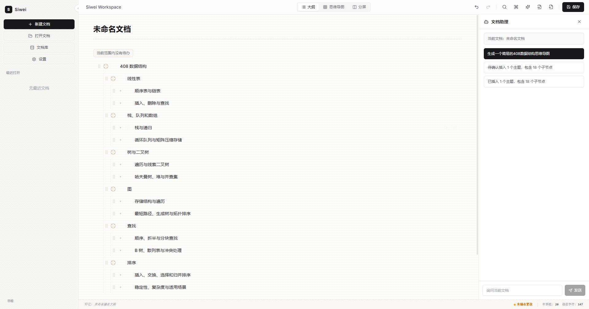
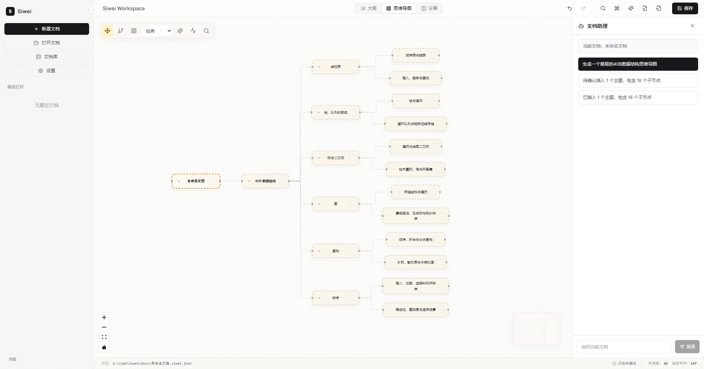
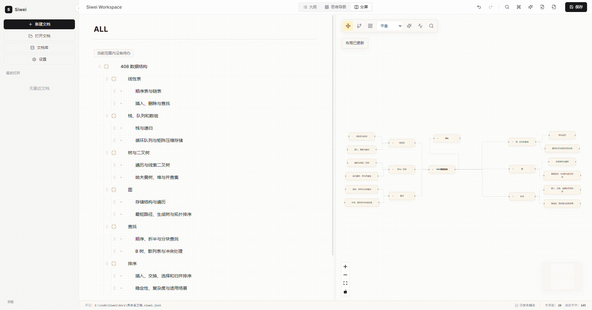

# Siwei

Siwei 是一个本地优先的桌面知识整理工具，用大纲、思维导图和分屏视图帮助你拆解长文档、项目计划、学习笔记与结构化想法。

它把文档保存为可读、可备份、可版本管理的 `.siwei.json` 文件，并提供 OPML、Markdown、交互式 HTML 分享包、纯文本和 JSON 导入导出、文档库检索，以及受控的内嵌 Siwei Agent 文档助手能力。Siwei 基于 Tauri 2、React、TypeScript 和 Rust 构建，适合希望把资料长期留在本地、同时保留清晰结构的人。

> 当前项目仍处于活跃开发阶段，接口、数据结构和打包流程可能随版本继续调整。

## 预览

### 大纲视图



### 思维导图视图



### 分屏视图



## 适合用来做什么

- 整理课程笔记、阅读摘录、论文结构和知识框架。
- 规划产品需求、开发任务、项目拆解和复盘材料。
- 把长文档拆成可折叠、可移动、可视化的节点树。
- 在本地维护可备份、可版本管理的结构化文档。
- 借助文档助手生成、扩展或重排大纲内容，并在确认后写入文档。

## 功能亮点

- 大纲编辑：支持节点增删改、层级调整、折叠、备注、标签、待办状态、撤销和重做。
- 思维导图：将大纲树自动布局为可视化导图，支持多种布局策略、分支聚焦、导图内搜索和 PNG/PDF 导出。
- 分屏工作区：在大纲和思维导图之间并行查看，适合边编辑边检查结构。
- 演示模式：从当前文档进入只读展示态，通过主工具栏或命令面板启动，支持大纲 / 导图切换、全屏展示、展示进度提示和手动下一步逐级展开；大纲展示区保持居中，逐级展开时减少阅读焦点跳动。
- 本地优先存储：使用 `.siwei.json` 保存完整文档树，保存时生成 `.bak` 备份。
- 导入导出：支持 `.siwei.json`、Markdown、OPML、交互式 HTML 分享包和纯文本，导入前可预览并选择作为新文档打开或追加到当前文档。
- 文档库：支持添加本地文档、刷新索引、全文检索、标签汇总和待办汇总。
- 文档助手：内嵌 Rust Agent Runtime，支持 OpenAI-compatible API 与 Claude API，AI 建议以预览和确认写入为边界。
- 测试 fallback：在没有 Tauri runtime 的浏览器测试环境中提供最小前端 fallback，便于覆盖首屏和关键交互。

## 技术栈

| 模块 | 技术 |
|---|---|
| 桌面应用 | Tauri 2 |
| 前端 | React 18、TypeScript、Vite |
| 样式 | Tailwind CSS |
| 状态管理 | Zustand |
| 导图渲染 | React Flow、Dagre |
| 后端 | Rust、Tauri command |
| 本地索引 | rusqlite |
| Agent Runtime | Rust、reqwest、OpenAI-compatible API、Claude API |
| 测试 | Vitest、Testing Library、Node test runner、Playwright |

## 快速开始

### 环境要求

- Node.js
- pnpm
- Rust 工具链
- Tauri 2 所需系统依赖

Windows 是当前优先开发和验证平台。

### 安装依赖

```bash
pnpm install
```

### 启动桌面应用

```bash
pnpm tauri dev
```

只启动前端开发服务器：

```bash
pnpm dev
```

默认 Vite 开发地址为 `http://127.0.0.1:1420`。

## 常用命令

```bash
# 构建前端
pnpm build

# 运行单元测试与脚本测试
pnpm test

# 运行 Playwright smoke 测试
pnpm test:e2e

# 使用 Tauri CLI
pnpm tauri
```

## 使用说明

1. 新建或打开一个 `.siwei.json` 文档。
2. 在大纲视图中编辑节点、调整层级、补充标签、备注或待办状态。
3. 切换到思维导图视图检查结构关系，也可以在分屏视图中同时查看两种形态。
4. 需要迁移或分享内容时，可以导出为 OPML、Markdown、交互式 HTML 分享包、纯文本、JSON、PNG 或导图 PDF；现场讲解时也可以直接进入演示模式。
5. 使用文档助手时，先配置兼容的模型服务，再通过预览和确认流程把建议写入当前文档。

## 数据与隐私

Siwei 默认围绕本地文件工作。主文档格式是 `.siwei.json`，最近文档、应用设置和文档库索引保存在 Tauri `appDataDir` 下。

文档助手能力需要用户自行配置 OpenAI-compatible API 或 Claude API。启用相关能力时，请确认你的模型服务提供方如何处理输入内容；Siwei 只在用户触发助手能力时把必要上下文交给已配置的服务。

## 项目结构

```text
.
├── index.html
├── package.json
├── scripts/                 # fixtures 生成等 Node 脚本
├── src/                     # React 前端
│   ├── app/                 # 应用入口和工作区状态
│   ├── components/          # 通用组件与布局组件
│   ├── features/            # 文档、大纲、导图、搜索、设置、文档库和 Agent 功能
│   ├── services/            # Tauri invoke 封装与浏览器测试 fallback
│   ├── test/                # 前端测试配置和 fixtures
│   ├── types/               # 前端共享类型
│   └── utils/               # 树操作和 ID 工具
├── src-tauri/               # Tauri Rust 后端
│   ├── capabilities/        # Tauri 权限配置
│   └── src/
│       ├── commands/        # 对前端暴露的 Tauri commands
│       ├── models/          # Rust 数据模型
│       ├── services/        # 文件、文档、索引、设置、Agent 等服务
│       └── utils/           # 错误、ID、时间等工具
└── tests/                   # Playwright e2e 测试
```

## 数据格式

Siwei 的主文档格式是 `.siwei.json`。一个文件包含完整的 `OutlineDocument` 文档树，核心内容包括文档 ID、标题、版本、时间戳、根节点，以及节点的文本、备注、折叠状态、待办状态、标签和子节点。

保存时后端会执行数据校验、pretty JSON 序列化、临时文件写入和备份文件生成。最近文档、应用设置和文档库索引保存在 Tauri `appDataDir` 下。

Markdown 导入以标题层级、缩进列表、任务列表、行尾标签和引用备注构造大纲树；标题和列表混合时，列表会挂到最近的上一级结构节点下。Markdown 导出由 Rust 后端统一生成。

OPML 导入优先兼容幕布主流 OPML，并兼容标准 OPML 2.0 常见 `outline` 层级。无法直接映射的节点属性会进入导入报告，节点相关字段也会追加到备注末尾的“导入保留信息”小节。HTML 导出定位为本地离线分享包，内嵌文档数据、样式和脚本，可在浏览器中只读查看大纲和导图并保留折叠 / 展开、导图适配视图、重置视图、拖拽和缩放交互；纯文本导出定位为可复制、可审阅、可粗略重建的稳定缩进树。完整备份仍建议使用 `.siwei.json`。

## 架构概览

```text
React UI
  -> Zustand stores
  -> src/services/siweiApi.ts
  -> Tauri invoke
  -> Rust commands
  -> Rust services
  -> 本地文件 / SQLite 索引 / 内嵌 Agent Runtime
```

前端通过 `src/services/siweiApi.ts` 统一调用 Tauri commands。浏览器测试环境没有 Tauri runtime 时，`browserInvokeFallback.ts` 提供最小 fallback。

后端按 command、model、service、utils 分层。command 负责 IPC 边界，service 负责文档读写、Markdown 转换、文档库索引、设置持久化和 Agent Runtime 生命周期管理。

Siwei Agent Runtime 运行在 Tauri/Rust 进程内，不依赖 Node sidecar 或 `@earendil-works/pi-agent-core`。文档库工具由 Rust 后端提供只读上下文，思维导图写入工具只向前端发送受控事件，最终修改仍由当前文档状态和用户确认流程接管。

## 开发说明

- 项目版本信息当前同步维护在 `package.json`、`src-tauri/Cargo.toml` 和 `src-tauri/tauri.conf.json`。
- 前端可见数据契约使用 camelCase，Rust 内部模型保持 snake_case。
- 业务逻辑变更优先补充测试；文档或样式类调整至少执行轻量验证。

## 贡献

欢迎围绕问题反馈、功能建议、文档补充和代码改进参与项目。提交改动前建议先运行相关测试，并尽量保持变更范围清晰、说明准确。

当前仓库仍在活跃演进中。如果你计划基于 Siwei 做较大的二次开发或长期维护，建议先查看现有数据格式、Tauri command 契约和 Agent 写入边界。

## 友链

- [Linux.do](https://linux.do/)：学AI，上L站

## License

当前仓库尚未声明开源许可证。使用、分发或二次开发前请先与作者确认授权范围。
